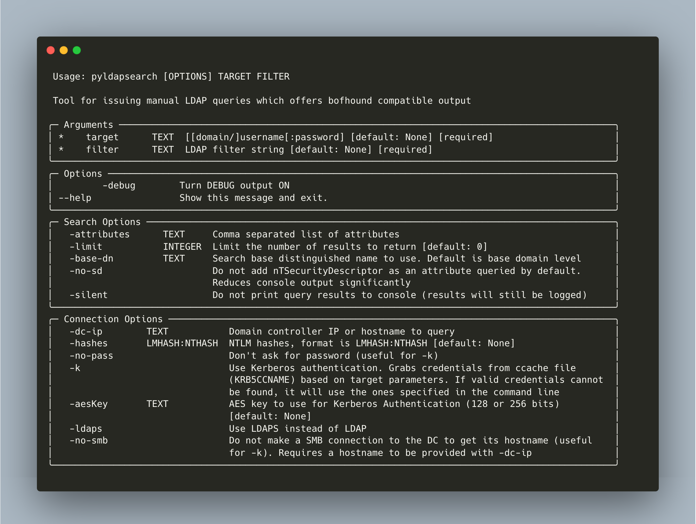

# THIS REPO IS NO LONGER ACTIVE
⛔🚧 This repo is no longer maintained. To submit an issue, pull request, or obtain the lastest version, reference [https://github.com/Tw1sm/pyldapsearch](https://github.com/Tw1sm/pyldapsearch) 🚧⛔

# pyldapsearch

This is designed to be a python "port" of the ldapsearch BOF by TrustedSec, which is a part of this [repo](https://github.com/trustedsec/CS-Situational-Awareness-BOF).

pyldapsearch allows you to execute LDAP queries from Linux in a fashion similar to that of the aforementioned BOF. Its output format closely mimics that of the BOF and all query output will automatically be logged to the user's home directory in `.pyldapsearch/logs`, which can ingested by [bofhound](https://github.com/fortalice/bofhound).

## Why would I ever use this?
Great question. pyldapsearch was built for a scenario where the operator is utilizing Linux and is attempting to issue LDAP queries while flying under the radar (BloodHound will be too loud, expensive LDAP queries are alerted on, etc). When pyldapsearch is combined with bofhound, you can still obtain BloodHound compatible data that allows for AD visualization and identification of ACL-based attack paths, which are otherwise difficult to identify through manually querying LDAP.

Outside of usage during detection-conscious and bofhound-related situations, pyldapsearch can be useful for issuing targeted, one-off LDAP queries during generic engagements.

## Installation
Use `pip3` or `pipx`
```
pip3 install pyldapsearch
```

## Usage


## Examples
Query all the data - if you intend to do this, just run BloodHound :)
```
pyldapsearch ez.lab/administrator:pass '(objectClass=*)'
```

Query only the name, memberOf and ObjectSID of the user matt
```
pyldapsearch ez.lab/administrator:pass '(sAMAccountName=matt)' -attributes name,memberof,objectsid
```

Query all attributes for all user objects, but only return 3 results
```
pyldapsearch ez.lab/administrator:pass '(objectClass=user)' -limit 3
```

Query all attributes of the user matt, specifying the IP of the DC to query
```
pyldapsearch ez.lab/administrator:pass '(&(objectClass=user)(name=matt))' -dc-ip 10.4.2.20
```

Query all objects, specifying the search base to use
```
pyldapsearch ez.lab/administrator:pass '(objectClass=*)' -base-dn 'CN=Users,DC=EZ,DC=LAB'
```

Execute a query without displaying query results to the console (results will still be logged)
```
pyldapsearch ez.lab/administrator:pass '(objectClass=*)' -silent
```

Perform a query using an anonymous bind
```
pyldapsearch 'ez.lab'/'':'' '(objectClass=*)'
```

Perform a query across a domain trust
```
pyldapsearch ez.lab/administrator:pass '(objectClass=*)' -base-dn 'DC=otherdomain,DC=local' -dc-ip 10.1.4.20
```

## Development
pyldapsearch uses Poetry to manage dependencies. Install from source and setup for development with:
```shell
git clone https://github.com/fortalice/pyldapsearch
cd pyldapsearch
poetry install
poetry run pyldapsearch
```

## References
- ldapsearch ([CS-Situational-Awareness-BOF](https://github.com/trustedsec/cs-situational-awareness-bof))
- [ldapconsole](https://github.com/p0dalirius/ldapconsole)
